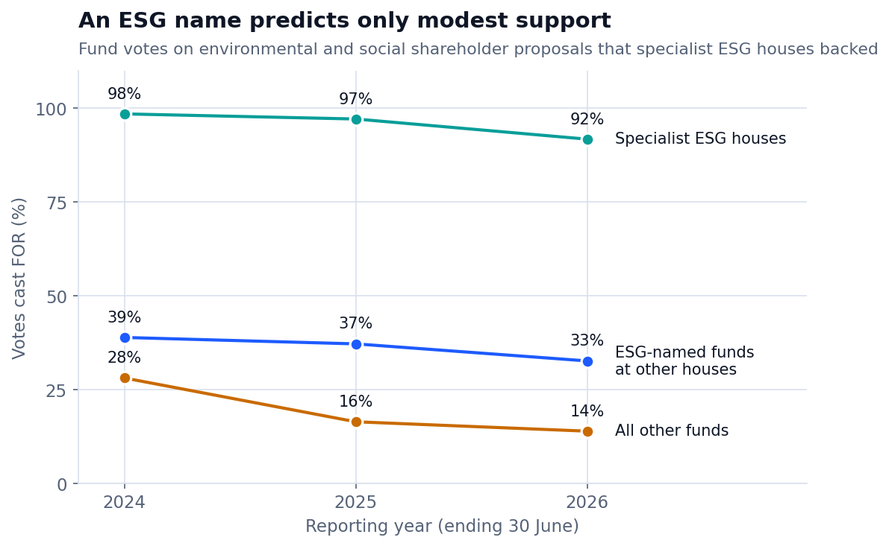
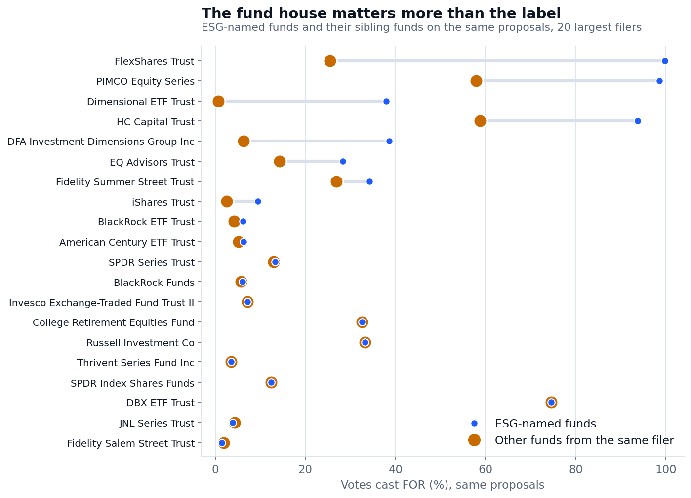
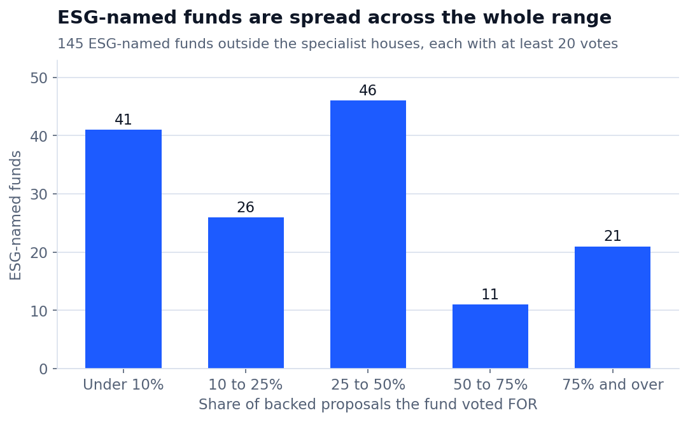

# Do ESG funds vote like ESG funds?

[](https://github.com/AshokReddy010/fund-proxy-voting/actions/workflows/ci.yml)

Every US fund must publish how it voted at company shareholder meetings. This project collects three years of those records from the SEC, 73.8 million votes from 12,416 funds, and asks one question:

**When a fund has "ESG" or "sustainable" in its name, does it vote differently from an ordinary fund?**

The short answer: a little, and far less than the name suggests. The fund house a fund belongs to tells you more about its votes than its label does.

## Findings

All figures are for shareholder proposals on environmental and social topics, in the reporting years ending June 2024, 2025 and 2026.

### 1. An ESG name predicts only modest support



Share of votes cast FOR proposals that specialist ESG fund houses backed:

| Fund group | 2024 | 2025 | 2026 |
|:--|--:|--:|--:|
| Specialist ESG houses (the yardstick) | 98.5% | 97.1% | 91.7% |
| ESG-named funds at other houses | 38.9% | 37.2% | 32.7% |
| All other funds | 28.1% | 16.4% | 13.9% |

ESG-named funds outside the specialist houses backed these proposals about a third of the time. That is more than ordinary funds, and well short of the specialists.

### 2. Ordinary funds' support halved in two years

Support from funds without an ESG name fell from 28.1% to 13.9% on the same kind of proposal. ESG-named funds slipped much less, from 38.9% to 32.7%.

### 3. Proposals that push the other way get almost no support from anyone

Many recent proposals ask companies to drop diversity programmes or climate targets. Every group voted for those about 1% to 2% of the time, ESG-named or not.

### 4. Most ESG-named funds vote exactly like their siblings

The fairest comparison is an ESG-named fund against ordinary funds from the same filer, voting on the same proposal. On proposals the specialists backed:

| | 2024 | 2025 | 2026 |
|:--|--:|--:|--:|
| Proposals compared | 5,139 | 3,612 | 2,173 |
| ESG-named fund voted the same as its siblings | 86.6% | 82.6% | 83.3% |
| ESG-named fund was more supportive | 11.8% | 16.3% | 16.1% |
| ESG-named fund was less supportive | 1.6% | 1.1% | 0.6% |

### 5. The fund house matters more than the label



At some filers the ESG-named funds vote very differently from their siblings: FlexShares Trust 99.7% against 25.4%, Northern Funds 99.4% against 42.6%. At others there is no difference at all: at SPDR Index Shares Funds, Russell Investment Company, TIAA-CREF Funds and Thrivent Series Fund, ESG-named funds matched their siblings on every proposal compared.

### 6. ESG-named funds are spread across the whole range



Of 145 ESG-named funds outside the specialist houses with at least 20 votes, 41 backed fewer than 10% of these proposals and 21 backed 75% or more. The full list is in [`reports/tables/esg_named_fund_support.csv`](reports/tables/esg_named_fund_support.csv).

## How to read these results

- **Voting is one measure of a fund, not the whole of it.** A fund can pursue ESG aims through which shares it holds or through private talks with companies. Low support here describes how a fund voted on these proposals. It is not evidence that a fund's label is misleading.
- **"Backed by specialists" is a chosen yardstick.** A proposal counts as pro-ESG when ten specialist ESG fund houses mostly voted for it. Their own 98% is therefore close to true by construction.
- **The ESG label is read from fund names.** 413 funds are labelled this way. Funds that follow ESG rules without saying so in their name are counted as ordinary funds.
- Everything here comes from public SEC filings, reported as filed.

## The data

Form N-PX filings from SEC EDGAR, in the structured XML format the SEC introduced for filings from mid-2024.

| | |
|:--|--:|
| Filings read | 33,929 |
| Filings containing votes | 16,251 |
| Vote records | 73,755,572 |
| From funds (all topics) | 67,094,632 |
| From investment managers (executive pay votes only) | 6,660,940 |
| Distinct funds | 12,416 |
| Files that could not be read | 4 |

The raw data is not in this repository. `download_votes.py` rebuilds it from the SEC in about nine hours, at the SEC's permitted request rate.

## What made this hard

**1. Filers write the same answer many ways.** "For" appears as FOR, For, F and Yes; a one-year vote as ONE YEAR, 1 Year, 1-YEAR, 1YR and 1.0. There were more than 40 spellings across ten real answers, and meeting dates in 12 formats. After cleaning, 99.97% of votes map to a standard value. A dbt test fails if unrecognised votes ever pass 1%.

**2. One column does not mean what its name says.** The field `managementRecommendation` does not hold management's recommendation. It records whether the vote was cast for or against that recommendation. Read literally, it makes almost every shareholder proposal look management-backed. Read correctly, funds vote with management 89.9% of the time.

**3. The same proposal is worded differently by every filer.** A single Microsoft proposal appears in 16 wordings. `scripts/label_proposals.py` matches them within each company meeting, turning 8,274 wordings into 3,850 proposals.

**4. A proposal's title does not tell you which side it is on.** "Revisit Plastics Packaging Policies" and "Report on Net Zero Business Performance Risks" sound pro-ESG, and both received 0% support from specialist ESG houses. So direction is decided by two independent signals:

| Signal | How it works | Coverage |
|:--|:--|:--|
| Reference votes | How ten specialist ESG fund houses voted on the proposal | 857 proposals, 84% of all fund votes |
| Wording | Keyword rules, with rules for opposing proposals checked first | Fallback for the rest |

Where both signals gave an answer, the first version of the wording rules agreed with the reference votes 91.2% of the time. Nearly every disagreement was an opposing proposal written in ESG vocabulary. Refining the rules raised agreement to 94.7% on 664 proposals, but they were refined on those same cases, so that figure is optimistic. The published results therefore use reference votes wherever they exist, and report wording-only labels separately.

## How it is built

```
SEC EDGAR (33,929 filings)
   └─ download_votes.py     read each filing, save votes as compact files
       └─ load_raw.py           load into DuckDB (73.8 million rows)
           └─ dbt
               ├─ staging       clean votes, dates, topics, filer types
               ├─ fct_votes     every cleaned vote
               ├─ dim_funds     one row per fund, with the ESG-name label
               ├─ fct_fund_es_votes   one answer per fund per proposal
               └─ marts         support by direction, sibling comparison
scripts/label_proposals.py      match wordings, label direction  → seeds/proposal_labels.csv
scripts/make_charts.py          charts from reports/tables
```

- **dbt:** 10 models, 1 seed and 21 data tests, including a custom test that no fund has two answers for the same proposal.
- **Unit tests:** 8 pytest checks on the SEC file reader, the wording matcher and the direction rules, run by GitHub Actions on every push.
- **Runs on a laptop:** DuckDB with a 2 GB memory limit rebuilds every table from the 73.8 million rows in about ten minutes.

## Run it yourself

Needs Python 3.10 or newer and about 10 GB of free disk. Commands are for Windows CMD.

```
git clone https://github.com/AshokReddy010/fund-proxy-voting.git
cd fund-proxy-voting
python -m venv .venv
.venv\Scripts\activate
pip install -r requirements.txt

python download_votes.py --test
python download_votes.py
python load_raw.py
dbt build --profiles-dir .
python scripts\export_results.py
python scripts\make_charts.py
```

`download_votes.py --test` is a ten-minute trial on a sample of filings. The full download can be stopped and restarted. To rebuild the proposal labels from scratch, run `scripts\export_proposals.py` and then `scripts\label_proposals.py`, and copy `proposal_labels.csv` into `seeds`.

## Limitations

- Reference votes cover 84% of fund votes. The other 16%, mostly smaller and non-US companies, rely on wording rules, which are less reliable.
- Wordings are matched within a company meeting by word overlap. Very differently worded copies of one proposal can stay separate, and two similar proposals at one meeting can merge.
- Where a filer sent a corrected filing for the same fund and year, the latest one is used. Corrections that cover only part of the original are not handled separately.
- A few filings report exactly 500,000 votes, which suggests a cap in how they were filed. This was not investigated.
- The comparison between an ESG-named fund and its siblings is made within one filer. Fund families that file through several legal entities are not joined together.

## Related work

[proxy-voting-panel](https://github.com/slriggss/proxy-voting-panel) studies the same filings for 22 selected funds and labels proposal direction with keyword rules. This project covers all 12,416 funds, adds the within-filer sibling comparison, and checks keyword labels against an independent signal.

## Tools

Python, DuckDB, dbt, pandas, Matplotlib, pytest, GitHub Actions.

## Author

Ashok Reddy Bhimavarapu · [Portfolio](https://ashokreddy010.github.io) · [LinkedIn](https://www.linkedin.com/in/ashokreddy1)
